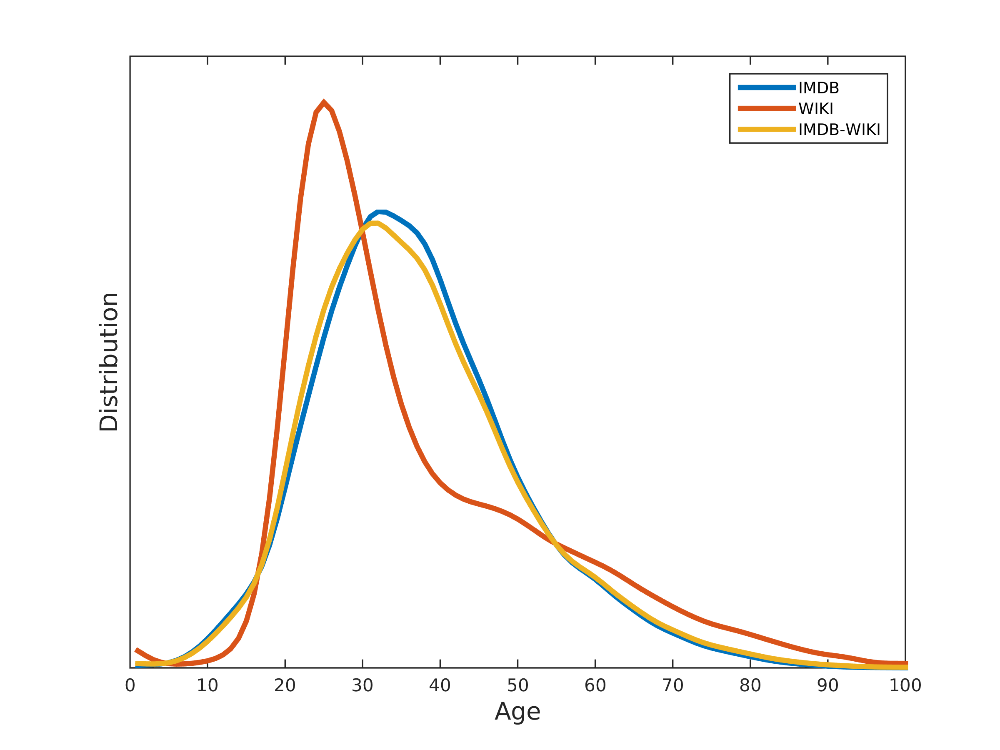
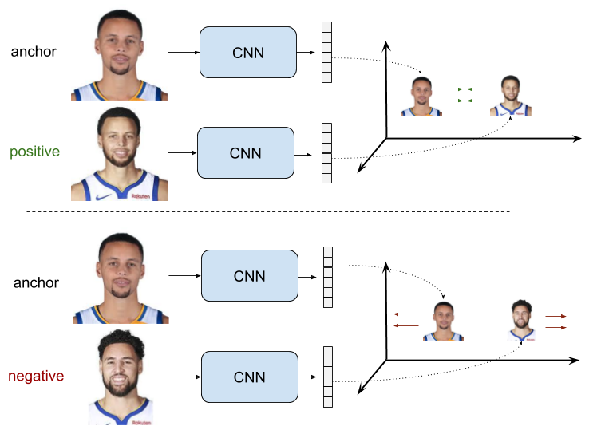
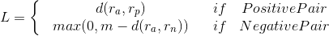
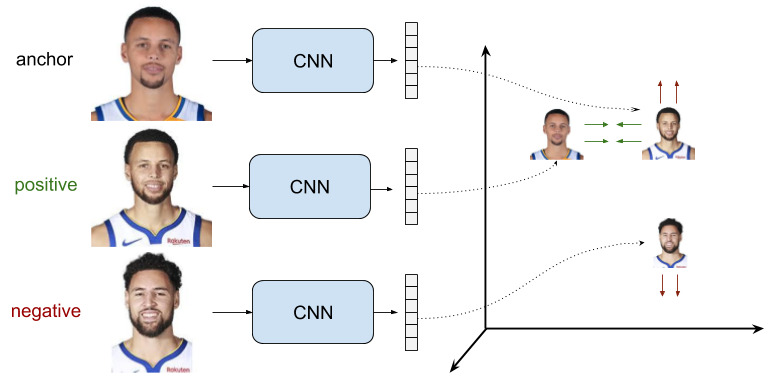

# Face-Verification
This repository about the implementation of Siamese Neural network model used for face verification. The dataset used for this task is IMDB-WIKI-face images Dataset. 

[Link](https://data.vision.ee.ethz.ch/cvl/rrothe/imdb-wiki/)

The dataset consists of 5,23,051 face images of 20,284 celebrities(4,60,273 imdb and rest from wiki)
The images with multiple faces or no faces in the dataset are not considered for the task.

# Challenges:
* The celebrities facial images are taken at multiple poses and their age vary across the images(multi-modal) compared to other face verification datasets.

# Why Neural Networks?
 Face space has a manifold structure on pixel space(by manifold hypothesis), which cannot be adequately captured by linear transformations(Hu, Lu, and Tan 2014). So I am using neural networks to learn the function for facial verification.
 
 
 # Siamese Nets, Triplet Nets
These two kinds of networks used when labels are very few and for comparing positive labels and negative labels(ranking). only one image is available for 38,614 celebrities out of 50546 celebrities
 
 The idea behind a siamese network is that it takes two inputs which need to be compared each other, so we reduce each input into a latent vector representation and compare it using some standard arithmetic. In the case of the Triple Nets, we take three inputs one is the ground truth and compare it with one positive and one negative sample using some standard arithmetic.
 
 # Loss
 ## Pairwise Ranking Loss(Contrastive loss)
 The objective is to learn representations with a small distance d between them for positive pairs and greater distance than some margin value m for negative pairs.
 
 
 The function of the margin is that, when the representations are produced for a negative pair are distant enough, no efforts are wasted on enlarging that distance, so further training can focus on more difficult pairs.
 
 
 
 ## Triplet Loss
 The objective is to learn the distance between the anchor sample and the negative sample represetations d(ra, rn) is greater than margin m) than the distance between the anchor and positive representation d(ra, rp)
 
 
 
 * **Easy Triplets**: d(ra, rn) > d(ra, rp) + m. The negative sample is already sufficiently distant to the anchor sample respect to the positive sample in the mebedding space. The loss is 0 and the net parameters are not produced.
 
 * **Hard Triplets**: d(ra, rn) < d(ra, rp). The negativee sample is closer to the anchor than the positive. The loss is positive(and greater than m).
 
 * **Semi-Hard Triplets**: d(ra, rp) < d(ra, rn) < d(ra, rp) + m. The negative sample is more distant to the anchor than the positive, but the distance is not greater than the margin, so the loss is still positive (amd smaller than m).
 
 
 
 
 
